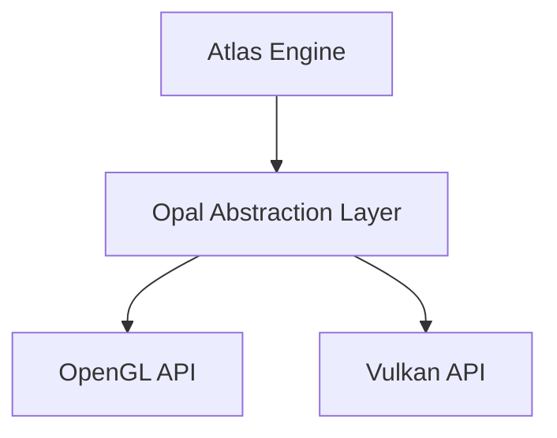

# The Migration to Opal

## The Purpose

We've been working on something huge. From its origins, the Atlas Engine has relied on OpenGL as its graphics API. While it is powerful and widely supported, OpenGL is very limited and it has held us back from achieving our vision for the engine.

For testing, we use macOS, which only supports OpenGL up to version 4.1. This has meant that we couldn't take advantage of many modern graphics techniques and optimizations that are available in newer versions of OpenGL or other APIs like Vulkan or DirectX 12.

To overcome these limitations, we decided to create Opal, our in-house abstraction layer that sits on top of both OpenGL and Vulkan. This allows us to write rendering code that can run on multiple graphics APIs without being tied to the limitations of any single one. 
Opal is really powerful and it allows us to implement advanced rendering techniques that were previously impossible with OpenGL alone. It is basically a translation layer that helps us convert normal rendering commands to work with either OpenGL or Vulkan, depending on what the user has available. 

## The Benefits

With Opal, we can now take advantage of the strengths of both OpenGL and Vulkan. For users with modern hardware and operating systems that support Vulkan, they can experience improved performance and access to advanced features that were previously unavailable.
At the same time, users on older systems or those that only support OpenGL can still run the engine, albeit with some limitations. This ensures that we can reach a wider audience while still pushing the boundaries of what the Atlas Engine can do.

For the Alpha 5 release in December, we will be shipping the Atlas Engine with Opal and Vulkan as the default rendering system, which pushes the engine to new heights in terms of performance and visual fidelity. Users will be able to experience the full potential of the engine with advanced rendering techniques, improved frame rates, and enhanced graphics quality.

## Why now?

The decision to migrate to Opal and Vulkan was driven by our desire to provide the best possible experience for our users. As hardware and software continue to evolve, it's essential for us to adapt and leverage the latest technologies to stay competitive in the industry. Also, we've been thinking about adding support for Global Illumination and Real-Time Ray Tracing for the next release, which are not feasible with OpenGL.

For Alpha 6, which is planned for starts of 2026, we will be focusing on a new and empowered rendering system that takes full advantage of Opal and Vulkan's capabilities. This will include implementing advanced lighting models, post-processing effects, and other visual enhancements that will elevate the overall quality of the engine.

## How does it work?

Opal acts as a bridge between the Atlas Engine and the underlying graphics APIs. When the engine needs to render something, it sends commands to Opal, which then translates those commands into the appropriate format for either OpenGL or Vulkan. This allows us to write rendering code that is agnostic to the specific graphics API being used, making it easier to maintain and extend the engine in the future.

> Since Opal is designed to facilitate the port to Vulkan, OpenGL will be deprecated in future releases. Users are encouraged to use Vulkan for the best experience with the Atlas Engine.
> While OpenGL support will still be available for legacy systems, it will not receive the same level of optimization and feature support as Vulkan.
> OpenGL's maximum supported version is going to be 4.1, which limits the engine's capabilities significantly.