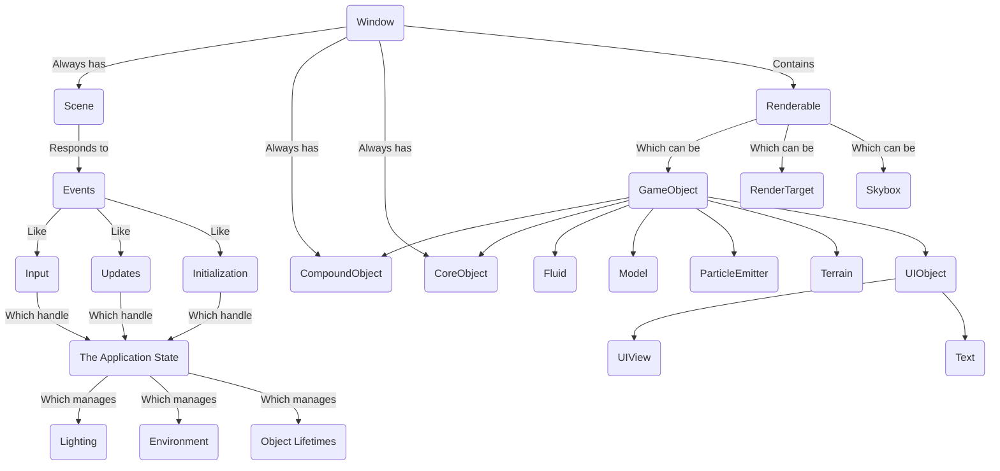
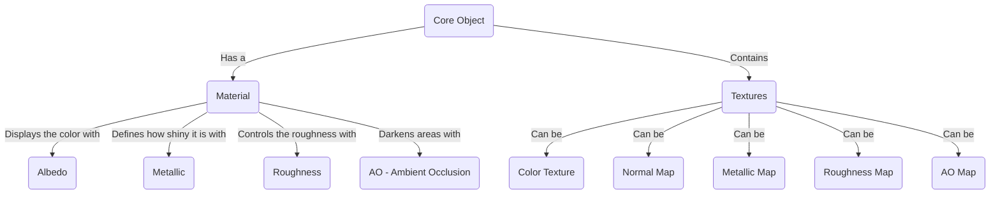

# Get Started with Atlas

In this guide, you'll create your first project using the Atlas Engine. Follow these steps to set up your development environment and build a simple application.
We'll assume you have already installed Atlas Engine by following the [installation guide](/learn/installation).

Once you have installed Atlas, open your terminal and run the following command to create a new project:

```bash
atlas create myProject
```

This will generate a new directory called `myProject` with the necessary files and folder structure.

Navigate into your project directory:

```bash
cd myProject
```

Open the project in your favorite IDE or text editor. If you're using Visual Studio Code, you can run:

```bash
code .
```

## What we are going to do

In this tutorial, we will:
* Create a simple window
* Create a light
* Set up a camera to view the scene
* Pack and run the project

## Create a Window

After creating your project, the first thing you want to look at the files you have:

### The `assets` folder

The `assets` folder will contain all the resources you need for your project, such as textures, models and shaders. You can add your own assets here as you develop your application.

### The `build` folder

The `build` folder is where the compiled binaries and intermediate files will be stored. You typically don't need to modify anything here manually.

### The `include` folder

The `include` folder contains the header files for your project. You can add your own header files here as you create new classes and functions.

### The `lib` folder

The `lib` folder contains any third-party libraries that your project depends on. You can add or update libraries here as needed. Atlas and its dependencies are usually managed automatically.

### The `<projectName>` folder

The `<projectName>` folder contains the main source code for your project. It will be named after your project. This is where you will write your application logic and implement the features of your game or simulation.

Finally, we must take a look at the other two important files:

### The `CMakeLists.txt` file

The `CMakeLists.txt` file is used by CMake to configure the build process for your project. It specifies the source files, include directories, libraries, and other settings needed to compile your application.

### The `atlas.toml` file

This file contains information about how will atlas build your project. You can specify the project name, version, author, and other metadata here. You can also define build options, such as the target platform and graphics API.

### Creating the Window

If you open the `main.cpp` file located in the `<projectName>` folder, you will see that Atlas has already set up a basic application structure for you. The code initializes the Atlas engine and creates a window and also puts a cube in the middle of the screen.
Let's take a look and break down the different parts of the code from top to bottom:

```cpp
#include <atlas/object.h>
#include <atlas/scene.h>
#include <atlas/window.h>
```

This includes the necessary headers from the Atlas Engine to work with objects, scenes, and windows. Head to the [documentation](/documentation) to learn more about these modules.

```cpp
class MainScene : public Scene {
  public:
    CoreObject cube;
    Camera camera;

    void initialize(Window &window) override {
        camera = Camera();
        window.setCamera(&camera);

        cube = createBox({1.0, 1.0, 1.0});
        window.addObject(&cube);

        this->setAmbientIntensity(0.2);
    }
};
```

Now, Atlas is built thinking about different types of objects. Here is a diagram that defines perfectly how is the strucuture of the Atlas runtime:



As you can see, the `Window` class always has a `Scene`, a `Camera`, and a `RenderTarget`. The `Scene` is responsible for handling updates, initialization, lighting, and environment settings. The `Renderable` objects can be of various types, including `GameObject`, `RenderTarget`, and `Skybox`.

The first thing we do in the code snippet is to create a new class called `MainScene` that inherits from the `Scene` class. This class will represent the main scene of our application. And looking at the diagram, we can see that the `Scene` class handles updates, initialization, lighting, environment settings, and most importantly, object lifetime.

Objects are passed to the engine as pointers, meaning the **address in memory of the object is passed**. Thus, objects must be **long-lived**. This means that they should not be deleted or go out of scope while the engine is using them. In this case, we define the `cube` and `camera` as member variables of the `MainScene` class to ensure they persist for the lifetime of the scene.

Now, here we can see the `initialize` method, which is overridden from the base `Scene` class. This method is called when the scene is initialized, and it receives a reference to the `Window` object.

```cpp
void initialize(Window &window) override {
    camera = Camera();
    window.setCamera(&camera);

    cube = createBox({1.0, 1.0, 1.0});
    window.addObject(&cube);

    this->setAmbientIntensity(0.2);
}
```

Now, as said here we can see that we create a new `Camera` object and set it as the current camera for the window using the `setCamera` method. This camera will determine the viewpoint from which the scene is rendered. Next, we create a cube using the `createBox` function, which generates a box-shaped `CoreObject` with the specified dimensions (1.0, 1.0, 1.0). We then add the cube to the window using the `addObject` method, which makes it part of the scene to be rendered. Finally, we set the ambient light intensity of the scene to 0.2 using the `setAmbientIntensity` method. This controls the overall brightness of the scene.

By default, Atlas provides a basic lighting and environment setup, that's why you will see the cube with a background skybox.

To run the code, we have the `main` function:

```cpp
int main() {
    Window window({"Atlas App", 800, 600, false, false});
    MainScene scene;
    window.setScene(&scene);
    window.run();
    return 0;
}
```

In the `main` function, we create a `Window` object with the title "Atlas App", a width of 800 pixels, a height of 600 pixels, fullscreen mode set to false and the capture cursor mode off. We then create an instance of our `MainScene` class and set it as the current scene for the window using the `setScene` method. Finally, we call the `run` method on the window, which starts the main application loop and begins rendering the scene.

To run this code, simply run `atlas run` in your terminal while inside the project directory. This will compile and execute your application, opening a window that displays the cube in the scene.


We managed to create a window and show a cube but the result is not as appealing as we would like. In the next sections we will enhance the scene by adding a light source and adjusting the camera position to get a better view of the cube. But first, let's tackle a bit with the material of the cube.

A material in Atlas defines how an object interacts with light and how it appears visually. Materials can include properties such as color, texture, reflectivity, and transparency. By applying different materials to objects, you can achieve various visual effects and enhance the realism of your scene.

Let's make our cube red. Here is a graph showing the elements of a material in Atlas:



To keep it simple, we are going to change the albedo of the material to red. To do this, we need to modify the `initialize` method of the `MainScene` class as follows:

```cpp
void initialize(Window &window) override {
    camera = Camera();
    window.setCamera(&camera);
    cube = createBox({1.0, 1.0, 1.0});

    cube.material.albedo = Color::red();
    window.addObject(&cube);
    this->setAmbientIntensity(0.2);
}
```

And include the units header at the top of the file:

```cpp
#include <atlas/units.h>
```

Now you can see the red cube when you run the project again, although not lit very well:


Lastly, we're going to increase the viewport size. In `main`, double the window size from `800x600` to `1600x1200`:

```cpp
Window window({"Atlas App", 1600, 1200, false, false});
```

## Create a Light

To enhance the visual appearance of our scene, we will add a light source. Lights are essential in 3D graphics as they illuminate objects and create shadows, highlights, and depth.

Now, the first thing you need to understand is that Atlas supports different type of lights. These are:

* **Directional Lights**: These lights simulate sunlight and emit light in a specific direction. They affect all objects in the scene equally, regardless of their position.
* **Point Lights**: These lights emit light in all directions from a single point in space. The intensity of the light decreases with distance from the source.
* **Spotlights**: These lights emit a cone of light in a specific direction. They have a position and a direction, and the light intensity decreases with distance and angle from the spotlight's direction.
* **Area Lights**: These lights emit light from a defined area, such as a rectangle or circle. They provide soft, diffuse lighting and are often used to simulate large light sources like windows or lampshades.

And also, you can find in the **scene** the ambient light, which is a global light that affects all objects in the scene equally. It provides a base level of illumination and helps to simulate indirect lighting. Right now, we have set the ambient light intensity to `0.2`, which gives a dim overall illumination to the scene.

The first thing we are going to do is to make Atlas calculate the best ambient light for us. To do this, we will remove the line where we set the ambient intensity in the `initialize` method and add the option to calculate it automatically:

```cpp
void initialize(Window &window) override {
    camera = Camera();
    window.setCamera(&camera);
    cube = createBox({1.0, 1.0, 1.0});

    cube.material.albedo = Color::red();
    window.addObject(&cube);

    this->setAutomaticAmbient(true); // Enable automatic ambient light calculation
}
```

With this, we can render again and see that the cube is a bit more visible now:


## Set up a Camera

To get a better view of the cube, we will adjust the camera position and orientation. By default, the camera is positioned at the origin (0, 0, 0) and looks down the negative Z-axis. This means that if we place an object at the origin, it will be very close to the camera and may not be fully visible.

To change the camera position, we can modify the `initialize` method of the `MainScene` class as follows:

```cpp
void initialize(Window &window) override {
    camera = Camera();
    camera.setPosition({0.0, 0.0, 5.0});
    window.setCamera(&camera); 

    cube = createBox({1.0, 1.0, 1.0});
    cube.material.albedo = Color::red();
    window.addObject(&cube);

    this->setAutomaticAmbient(true);
}
```


Now, you can see the cube from a farther distance, making it fully visible in the window. But what if we want to see it from a different angle? We can rotate the camera around the cube to get a better view. And better, we can make the camera orbit around the cube continuously to create a dynamic effect. To achieve this, we will override the `update` method of the `MainScene` class and add the following code:

```cpp
void update(Window &window) override {
    static float angle = 0.0f;
    float deltaTime = window.getDeltaTime();
    angle += deltaTime; // Increment the angle based on the elapsed time
    float radius = 5.0f; // Distance from the cube
    float x = radius * cos(angle);
    float z = radius * sin(angle);
    camera.setPosition({x, 0.0f, z});
    camera.lookAt({0.0f, 0.0f, 0.0f}); // Make the camera look at the cube
}
```


And that's it! You have successfully created your first project using the Atlas Engine. You have set up a window, added a cube with a red material, created a light source, and adjusted the camera to get a better view of the scene.

## Pack and Run the Project

But before finishing, let's see how to pack and run the project properly. Packing the project involves compiling the source code and bundling all necessary assets into a distributable format. This process ensures that your application can be easily shared and run on different systems.

Before packing the project, let's take a look at the `atlas.toml` file. This file contains configuration settings for your project, including metadata such as the project name, version, and author. You can also define build options, such as the target platform and graphics API. This is the default version:

```toml
[project]
name = "myProject"
app_name = "myProject"

[pack]
icon = "none"
supported_platforms = "all"
```

Now, let's add an icon to our project. You can use any image file you like, but it's recommended to use a square image with a resolution of at least 256x256 pixels for better quality. Place the image file inside the `assets` folder of your project. Then, update the `atlas.toml` file to include the path to your icon:

```toml
[project]
name = "myProject"
app_name = "myProject"

[pack]
icon = "assets/my_icon.png"
supported_platforms = "all"
```

The first thing is to run the following command in your terminal while inside the project directory:

```bash
atlas pack
```

In the `app` folder that is created after packing, you will find the executable file for your application along with all the necessary assets bundled together. You can now share this folder with others or run the application on different systems without needing to set up the development environment again.

That's it for this tutorial! You have successfully created, packed, and run your first project using the Atlas Engine. From here, you can continue to explore the engine's features and build more complex applications. Happy coding!

-----

Max Van den Eynde from Atlas Engine, November 2025